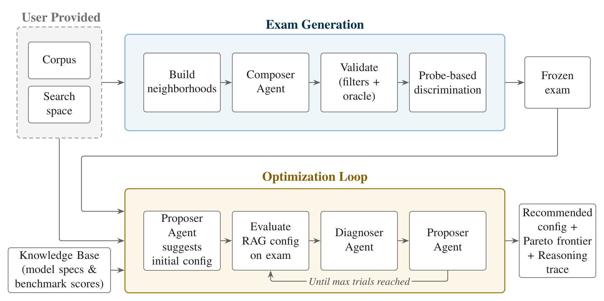

# How it works

Agentic AutoRAG searches for a good RAG pipeline configuration for your corpus. A run has three phases. It writes an exam from your documents, it runs a reasoning loop that evaluates one configuration per trial and decides what to try next, and it selects a recommendation from the trials it ran.

<picture>
  <source media="(prefers-color-scheme: dark)" srcset="../assets/architecture-dark.png">
  
</picture>

## 1. Exam generation

The optimizer needs a signal to optimize against. On the first run the examiner model reads your corpus and writes open-ended questions with ground-truth answers, each anchored to verbatim spans of the source documents. Every candidate question passes through gates: the phrasing must stand on its own without "the document", every cited span must be found in its document, the judge model must be able to answer it from the cited spans alone, and numeric answers must match a formula. The survivors are then run through a small ladder of probe pipelines, from a weak configuration to a strong one, and the exam keeps the questions that separate them. Questions every probe answers teach the optimizer nothing and are dropped.

The exam is written to `exam.json` in the output directory and reused on every later run, so all trials of a project score against the same questions. If fewer than half of `examiner.exam_size` questions survive the gates, the run stops with an error rather than optimizing against a thin exam. The stages, the settings that control them, and the neighborhood weighting are described in [exam_generation.md](exam_generation.md). If you already have questions with known answers, you can skip generation entirely, see [custom_exam.md](custom_exam.md).

## 2. The optimization loop

Trials are numbered from 1 to `meta.max_trials`. Trial 1 is proposed by the optimizer model from the search space, the knowledge base of model benchmarks and prices, and your `meta.corpus_description`. It is an informed first pick (a strong embedder and a capable generator, stepping down on price in cost-aware mode), not a random draw.

Each trial follows the same steps.

1. **Build.** The corpus is chunked and embedded for the trial's chunking settings and embedding model, or loaded from the cache when an earlier trial used the same pair. An in-memory index is built for the trial's index type.
2. **Evaluate.** The trial pipeline answers every exam question. An answer is correct when it matches the canonical answer or one of its variants after normalization, or when the judge model accepts it. The evaluator also records which cited spans or documents came back from retrieval, so each failure can be attributed to retrieval or to generation.
3. **Diagnose.** The diagnoser reads the trial's metrics, a table of failures by failure mode and question type, and a sample of failed questions with their retrieved context. It writes a short explanation of why the configuration scored as it did. It never sees costs or the configurations of other trials, so the diagnosis is about this pipeline's behavior, not about what to try next.
4. **Propose.** The proposer reads the diagnosis, the recent trials in full plus the best trial and every frontier member, a complete list of configurations already tried, the search space, the knowledge base, and the plan it wrote for itself on the previous trial. It returns the next configuration as YAML together with a rationale and an updated plan.

A proposal is parsed and validated against the search space. Invalid proposals are sent back with the violations, up to three times. A proposal identical to an earlier trial is also sent back, up to three times. If the proposer still cannot produce a new valid configuration, the orchestrator perturbs one lever of the current configuration at random and continues.

A trial whose pipeline fails on more than half of the questions counts as failed. It gets no history record. Instead the proposer receives the error summary and proposes a recovery configuration. After the last trial there is no diagnosis and no proposal. The loop stops only at `meta.max_trials`. There is no early stop and no spending cap, so set the trial budget to what you are willing to pay for.

## 3. Scoring and selection

The objective is answer accuracy, the share of valid questions answered correctly. Exact match and F1 are recorded as diagnostics but do not drive the search.

With `meta.cost_aware: true` (the default) every trial also has a cost: the LLM cost per query of the answering path, which covers query expansion, passage compression, and generation. Embedding, reranking, and the judge are excluded because they are not what your users pay for per query. The trials that no other trial beats on both accuracy and cost form the Pareto frontier. It is recomputed after every trial, so a new trial can push an earlier one off the frontier.

At the end of the run the optimizer model writes `optimization_summary.md` and, in cost-aware mode, chooses the recommended trial from the frontier: the one that is capable and cheap, rather than the top scorer at any price. The choice is validated against the frontier. If you pass `--skip-final-report`, or the model fails to name a frontier trial, the recommendation falls back to the highest-accuracy trial, cheapest on ties. With `meta.cost_aware: false` the recommendation is always the highest-accuracy trial, and the summary lists trials by accuracy instead of a frontier.

The recommended configuration is written to `recommended.yaml`, and every frontier member to `frontier/`. Both are complete pipeline configurations. See [outputs.md](outputs.md) for everything a run writes.
